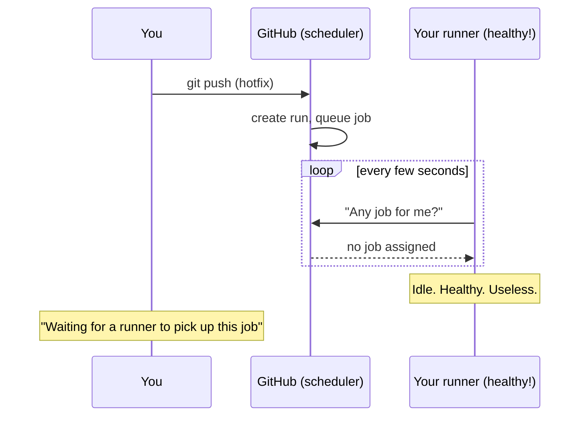
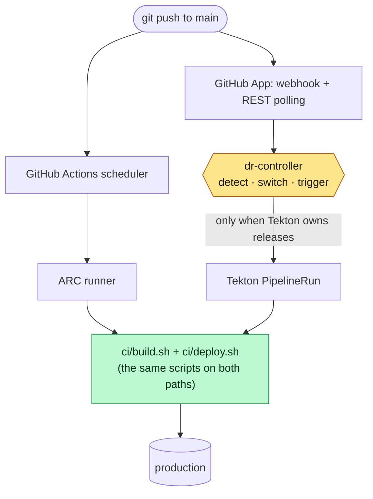
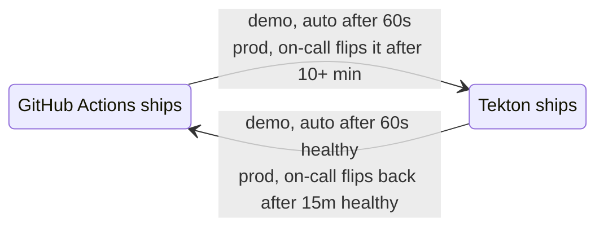
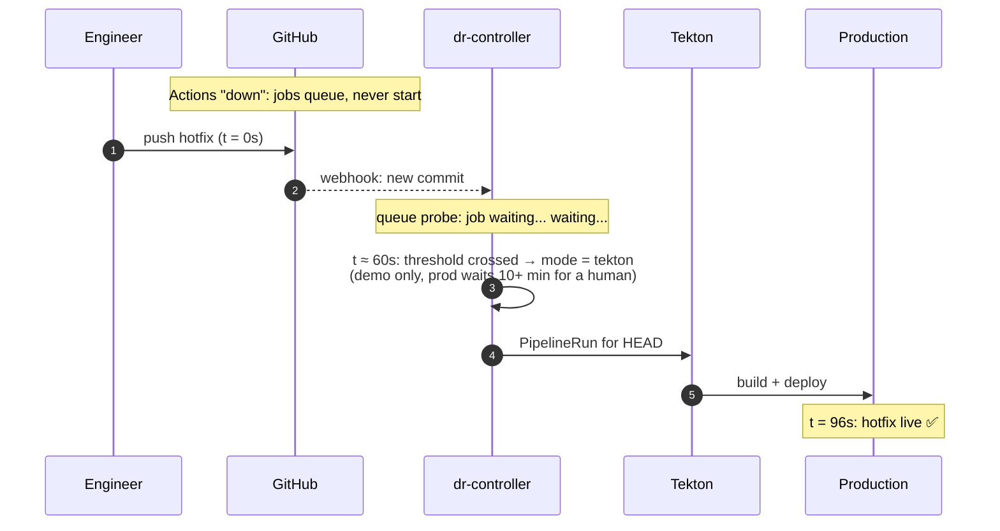
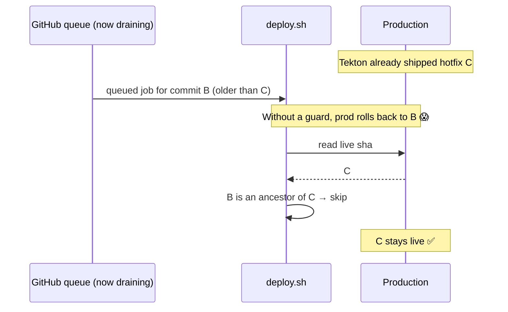
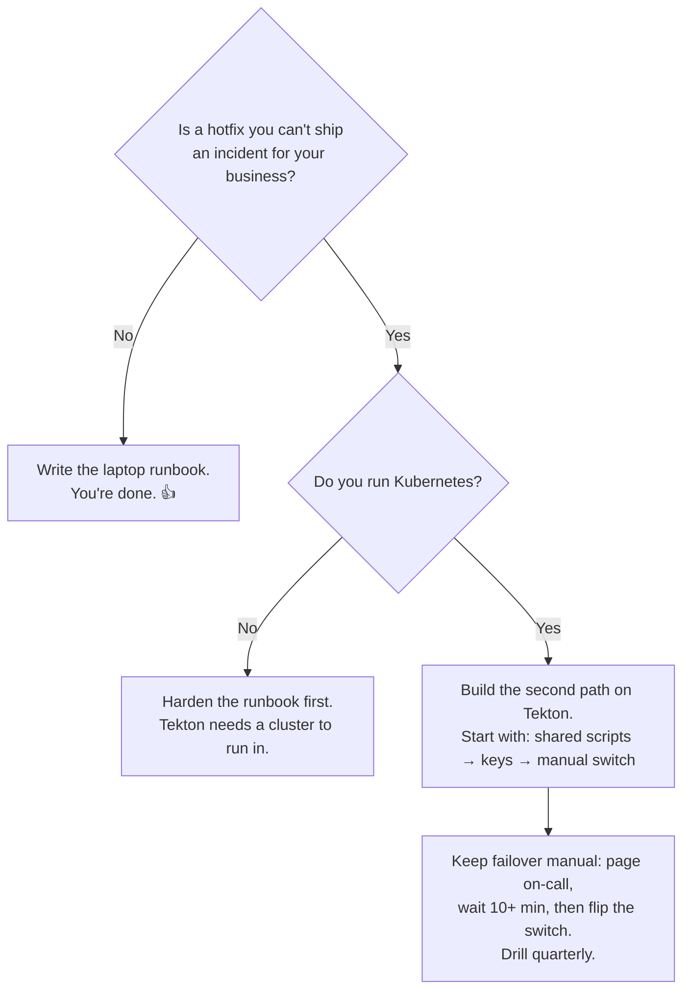

It's 2 p.m. on a weekday and payments are failing for some of your users. Your team finds the bug in twenty minutes, writes a three-line fix, gets it reviewed and merges it.

Then the release job shows:

> **Waiting for a runner to pick up this job.**

Five minutes pass, then ten. You run your own runners, so you go and check them. They're healthy and idle, and they're waiting too.

The outage part isn't made up. On 26 August 2026, GitHub's own write-up says *"Actions jobs failed to start"* for 43 minutes, and runs were then delayed by more than 5 minutes for two more hours while the backlog drained. Three weeks earlier, an Actions incident stayed open for almost **eleven hours**.

Production stayed up through both incidents. What stopped was the ability to *change* it.

We spend years on disaster recovery for the systems that serve users: multi-AZ databases, cross-region replicas, failover runbooks. Then every fix for those systems goes out through a single hosted CI provider.

> *"An outage in your CI is an outage in your ability to fix every other outage."*

**What you'll get from this post (about 12 minutes):**
- 🧩 why self-hosted runners **don't** protect you, even though most teams assume they do
- 🛠️ how to use [Tekton](https://tekton.dev), the open-source pipeline engine for Kubernetes, as a DR path for GitHub Actions. In a drill, Tekton started the release **within a second** of the outage being detected. The switch is never the slow part; your wait policy and your build are
- 🪤 three problems we only found *after* we thought we were finished
- ✅ a 10-question scorecard that tells you whether your pipeline would survive an outage this afternoon

The demo behind it is a small reference implementation of Tekton as a DR path, and it runs on a laptop: **[github.com/agarwalvivek29/github-actions-dr-demo](https://github.com/agarwalvivek29/github-actions-dr-demo)**

---

## Quick gut check before you read on

Tick the ones that are true for your team **today**:

- [ ] We've shipped to production *without* GitHub Actions in the last 90 days
- [ ] Our release workflow uses no marketplace actions (`uses: some/action`)
- [ ] Our release secrets and cloud credentials have a source outside GitHub
- [ ] A hotfix PR can merge while Actions is down

If you ticked all four, you can probably skip to [the twists](#three-things-that-bit-us-after-we-thought-we-were-done). Everyone else, keep your count in mind. We'll come back to it.

---

## 1. Why your runners are waiting too

"We self-host our runners, so a GitHub outage won't stop us." It's the usual assumption, and it doesn't hold up once you look at how a runner gets work:



A runner doesn't listen on a port. It holds an outbound long-poll to GitHub and waits to be handed a job. Actions Runner Controller (ARC) on Kubernetes works the same way. **GitHub decides when work exists, and runners wait to be told.** Self-hosted runners give you your own *execution*, but *scheduling* still belongs to GitHub.

> *"Your self-hosted runners are only as available as the queue that feeds them."*

And it's the scheduler that keeps failing. Of GitHub's last 50 incidents, **10 affected Actions**. The median one lasted **84 minutes** and the longest lasted **10.7 hours**. Almost every description talks about *starting* work, not running it.

<details>
<summary><b>📊 See the incidents (from GitHub's own status API)</b></summary>

| Date (2026) | Duration | GitHub's description |
|---|---|---|
| 24 Jul | 79 min | "Disruption with some GitHub services" (Actions degraded) |
| 25 Jul | 26 min | "delays in GitHub Actions run starts" |
| 25 Jul | 42 min | "workflow run failures and delays for some users" |
| 29 Jul | 34 min | "timeouts or failures with runner registration and workflow runs may be delayed" |
| 6 Aug | ~10.7 h | "workflow runs are failing to start… Actions REST API returning errors" |
| 17 Aug | ~7.6 h | GitHub-wide: ~20% API/web errors; Git operations and Webhooks degraded too |
| 24 Aug | 38 min | "Failures while queuing and running Actions jobs" |
| 26 Aug | ~2.8 h | "Actions jobs failed to start" for 43 min, then 5+ min start delays while queues drained |
| 26 Aug | 90 min | PR-triggered runs: "20% of runs delayed > 5 minutes, up to 4% failed to trigger"; PR merges blocked |
| 13 Sep | 89 min | Database replication delays; ~28 services degraded, including Actions |

Status-page windows are opened and closed by people, and many of these incidents were partial: most jobs still ran. The duration is how long you're *exposed*, not how long every release is stuck.

Source: `https://www.githubstatus.com/api/v2/incidents.json`, last 50 incidents (24 Jul to 28 Sep 2026). Durations run from `created_at` to `resolved_at`.
</details>

---

## 2. Tekton: a scheduler you run yourself

If the scheduler is the weak point, the backup needs a scheduler of its own. The rule we held to: **the backup path must not depend on the thing it's backing up.** Another hosted CI only moves that dependency to a different vendor, so we wanted a pipeline engine that runs where we already run things, with no SaaS queue in the way. That's [Tekton](https://tekton.dev).

Tekton is an open-source pipeline engine for Kubernetes. It's a CD Foundation project, licensed under Apache-2.0. Four things make it a good fit for DR:

- **You run the scheduler.** Tekton is a set of Kubernetes resources (`Task`, `Pipeline`, `PipelineRun`) plus a controller that runs in your cluster. Starting a release is `kubectl create` of a PipelineRun, so there's no outside queue to wait on.
- **It's built for CI.** Steps, workspaces, params and results map directly onto a build-and-deploy job, so your existing release translates almost one to one.
- **It's cheap while idle.** PipelineRuns only use resources while they run, which matters for a path that sits unused most of the year.
- **The wider ecosystem fills the gaps.** Tekton Chains signs what it builds and records provenance. Pipelines-as-Code, built on Tekton, connects it to GitHub if you later want more than a backup.

The Tekton path still clones from GitHub and reads it through the REST API. That's a deliberate trade-off. In most Actions incidents, Git operations and the API stay up, because what fails is the Actions scheduler. Not always: on 17 August, Git operations, Webhooks and the API were degraded alongside Actions for most of a day. If you need to survive that, keep a read-only mirror of every repo that can release.

The same applies to images. Tekton's own images and most catalog step images are published on GHCR. That's normally fine, because the Actions scheduler is what usually fails, not the registry. In production, still pull them through your registry's pull-through cache (ECR, Artifact Registry, Harbor), so a node replaced mid-incident doesn't depend on GitHub for its images.

> **Tekton does the heavy lifting.** What we built is a thin layer on top that turns it into a DR path for GitHub Actions, plus a demo that shows the failover happening.

<details>
<summary><b>🤔 Why Tekton, and not GitLab CI, Buildkite, Jenkins or Argo?</b></summary>

- **Hosted CI (GitLab.com, Buildkite, CircleCI)** moves the dependency to another vendor's control plane. Buildkite agents, for example, poll Buildkite's SaaS for work, just as GitHub's runners do. Self-managed GitLab avoids that, but it's a lot to operate for a backup.
- **Jenkins** works, but you'd be running a stateful controller and keeping plugins patched for a path that's idle 99% of the time. If you already run Jenkins well, use it.
- **Argo Workflows** is also Kubernetes-native and a reasonable choice. Tekton's building blocks map more directly onto CI steps, and Chains gives you build provenance.
- **A runbook to deploy from a laptop** is a legitimate tier-zero plan, so write it down whatever you choose. It just isn't something you can audit or repeat reliably.
</details>

---

## 3. The thin layer around Tekton

Our part is deliberately small: one controller and one rule about scripts. This is how they fit around Tekton and GitHub:



The layer rests on three ideas.

**① One build, two orchestrators.** The GitHub workflow doesn't contain the build. It only calls it:

```yaml
steps:
  - uses: actions/checkout@v5
    with: { fetch-depth: 0 }   # full history; deploy.sh needs it (see twist 2)
  - run: ./ci/build.sh
  - run: ./ci/deploy.sh
```

Checkout is the only `uses:` step, and the Tekton Pipeline does its own clone before running the same two scripts. If failing over meant rewriting your build in the middle of an incident, you wouldn't really have a failover.

> *"Every marketplace action in your release path is a dependency on GitHub you haven't written down."*

**② One switch, one owner.** A single ConfigMap value, `mode: auto | tekton | gha`, decides which path ships. The controller publishes which path currently owns releases, and `deploy.sh` exits early on the path that doesn't. So the two paths never deploy at the same time, even when a partial outage lets some Actions jobs through. When releases move to Tekton, the controller ships the current HEAD straight away, because everything pushed before the switch is stuck in GitHub's queue. Failing back waits until Actions has been healthy for a cooldown period, because GitHub's recoveries often wobble:



> ⚠️ **Demo vs production: `mode` is a dial.**
> The demo runs `auto` so a drill fits into a talk. In production we run manual: detection **pages the on-call**, and after **10+ minutes** a human sets `mode: tekton`. Most blips clear up within that window. Once flipped, the controller still ships every merge by itself, so nobody runs pipelines by hand for hours.

**③ Two detectors, because they fail in different ways.**
- **The status page** is authoritative but slow, because GitHub only declares an incident after its engineers confirm it.
- **The queue probe** is our own signal and reacts sooner. It asks: *"how long has **our** release job been queued without a runner?"*
- **Silence counts as a signal too.** In the worst incidents there's nothing in the queue to time: runs "failed to trigger", or the Actions API itself returns errors (6 August). So the probe also fires when a commit on `main` has no workflow run after the threshold, or when it hasn't been able to read the queue for that long. A probe that treats "I can't see" as "healthy" will stay green through the incident you built it for.

> *"A status page tells you what GitHub has confirmed, not what your releases are going through."*

---

## 4. The failover, second by second

We can't break GitHub's scheduler, so drills reproduce its symptom: we scale the ARC runner scale set to zero. GitHub accepts the job, queues it and never assigns a runner, which is exactly what the queue probe measures. For the status page signal, the controller reads a proxy of the real githubstatus.com feed that lets us override single components. The detection code is the same in drills and in production; only the URL changes.

Here's a recorded drill. We broke Actions, then pushed a hotfix:



| t | What happened |
|---|---|
| 0s | Hotfix pushed. Actions accepts the job and never starts it |
| 63s | Queue probe crosses its 60s demo threshold → `mode = tekton`, PipelineRun created **the same second** |
| 96s | Live. 33s to build and deploy a tiny Go app |

The number that belongs to this design is **detection → pipeline start: under a second**. The 60s is a dial (10+ minutes and a human in production), and the 33s is a toy app. Your build takes what it takes. We left the status page green for this drill, because that's what it shows in the first minutes of most real incidents.

**Pause and predict:** what if webhooks are down *as well*? How does Tekton even find out a commit landed?

<details>
<summary><b>Reveal</b></summary>

**Polling.** GitHub's incidents are usually limited to one component, so the REST API often keeps working while Actions and Webhooks are down. The controller reads the branch head every few seconds. If it sees a commit that no webhook announced, it waits a short grace period (20 seconds in the demo) for the webhook, then triggers the release itself.

Drill result: with releases already on Tekton and webhooks down, a hotfix went from push to live in **60 seconds**, with no webhook involved.

Three triggers (webhook, poller and a break-glass button) are only safe because they're idempotent: the automatic triggers start at most one PipelineRun per commit sha. The break-glass button is the deliberate exception. It's how a human retries a run that failed for a flaky reason.
</details>

**What to expect.** In the demo, the failover itself (detection → pipeline running) took **under a minute**. In production, expect the hotfix live **within about 5 minutes of the on-call flipping the switch**; nearly all of that is your build and rollout. The full clock from the start of the outage is longer, because we choose to wait before failing over:

> **RTO = wait before failover (≥ 10 min) + human decision + pipeline + rollout**
>
> With page-to-decision taking 5–15 minutes, a cold-cache build of about 5 minutes (measure yours on the DR path, not on warm Actions runners) and a 1-minute rollout, that comes to **20–30 minutes** from the start of the outage to the hotfix being live.

**Your own runner cap can look like a GitHub outage.** Most teams cap their runner scale set to control cost. When 40 engineers push at once, jobs queue because *you* ran out of runners, not GitHub, and a naive queue probe pages someone for nothing. Two fixes: give the release workflow its own small scale set (`minRunners: 1`) so it never waits behind PR builds, and set the threshold from the release job's p99 queue time *at peak*. The DR side is bounded too: Tekton carries only releases to `main`, one at a time and latest-wins, so a 40-person push storm becomes one release of HEAD, not 40 builds.

---

## Three things that bit us after we thought we were done

Getting Tekton to run our release was the easy part. These three are where the real work went.

### 🔑 Twist 1: the second pipeline had no keys

A GitHub workflow gets a lot from its host without you noticing, and a second pipeline has to bring its own version of each of these:

| GitHub gave us… | The Tekton path needs… |
|---|---|
| `GITHUB_TOKEN` | A GitHub App installation token, created for each run in a Secret that's deleted with the run |
| `secrets.*` | One source of truth (Vault / AWS Secrets Manager) that feeds **both** paths |
| Cloud access through GitHub OIDC | Its own workload identity (IRSA, EKS Pod Identity or GKE Workload Identity) with the **same** IAM permissions |
| GHCR | A registry outside GitHub. GHCR has its own incidents |
| Required reviewers | A restricted switch, plus an audit log of everything shipped while failed over |

> *"A second pipeline is only real if it has its own keys."*

**The trap most teams discover too late:** if branch protection requires an Actions check, **your hotfix can't merge**. The 26 August incident specifically mentioned "blocked pull request merges". Choose your way out *before* you need it: give a small on-call group a ruleset bypass, or have the Tekton path report the same check. If the required check is pinned to the GitHub Actions app as its source, a status from Tekton won't satisfy it.

A bypass means the PR merges without its CI having run, so make sure the release path itself is the safety net. Our `build.sh` runs the test suite before it builds anything, on both paths, so a bypassed merge is still tested before it reaches production. If your tests only run in PR workflows, the DR path ships untested code. Decide whether that's acceptable now, not in the middle of an incident.

### 🔁 Twist 2: recovery is the second outage

GitHub recovers. Is that the end of it?



When GitHub recovers, the jobs that queued during the incident start running, and each one deploys the commit it was created for. Without protection they roll production **backwards**, minutes after you fixed it. GitHub's `concurrency:` group only helps a little: it cancels older pending runs, but it can't see what Tekton has already shipped. So the guard lives in the shared deploy script, which both paths go through:

```bash
# live-sha is written only after `rollout status` succeeds, so a failed rollout can be retried
live=$(kubectl -n "$NAMESPACE" get deploy app \
  -o jsonpath='{.metadata.annotations.dr\.demo/live-sha}')
if [[ "$live" == "$GIT_SHA" ]]; then
  echo "already live: ${GIT_SHA:0:7}, nothing to do"; exit 0
fi
if [[ -n "$live" && "${ALLOW_ROLLBACK:-}" != "true" ]]; then
  rc=0; git merge-base --is-ancestor "$GIT_SHA" "$live" || rc=$?
  case $rc in
    0) echo "STALE: ${GIT_SHA:0:7} is older than live ${live:0:7}, refusing to roll back"; exit 0 ;;
    1) ;;  # not an ancestor: newer or diverged, so deploy
    *) echo "can't compare ${GIT_SHA:0:7} with live ${live:0:7} (shallow clone?), refusing"; exit 1 ;;
  esac
fi
```

Three details matter here. `merge-base` exits 0, 1, or 128 on error, for example when the clone is shallow and doesn't contain the live commit. A plain `if` treats the error as "not an ancestor" and deploys, which is exactly the rollback the guard exists to stop, so we check the exit code and fail closed. (Tekton's catalog `git-clone` defaults to `depth: 1`, so the Tekton clone needs full history too.) Second, the live marker is written only after the rollout succeeds, so a failed rollout doesn't leave a SHA marked live that isn't serving traffic. Third, an intentional rollback needs a way past the guard, so `ALLOW_ROLLBACK=true` is part of the break-glass runbook.

In the drill, the queued job ran once Actions came back and printed `already live: 0b31e22, nothing to do`. Two paths could pass this check at the same moment, which is why only the path that owns releases is allowed to deploy (see ②). The one window left is the moment of the switch itself. If you need to close that too, hold a Kubernetes `Lease` around the check and the deploy.

**If you deploy through GitOps** (Argo CD, Flux), the shape is the same, but the deploy step is a commit to a config repo. That config repo is usually on GitHub too, so it needs the same mirror, and the stale guard becomes an ancestry check on the image tag before you write it.

> *"Recovery is the second outage. Plan for the queue to drain."*

### 🎭 Twist 3: the drill that lied

Our first webhooks-outage drill came back at **34 seconds** from push to live. That looked great.

Then we read the PipelineRun's trigger label. It said `webhook`, but webhooks were supposed to be down.

The demo forwards webhooks through a smee relay, because a laptop has no public ingress. The relay ran Node as PID 1, and a process running as PID 1 ignores `SIGTERM` unless it installs a handler. Its pod sat in `Terminating` for the full 30-second grace period, still connected and **still forwarding events**. The "outage" hadn't actually begun when we pushed the hotfix.

After the fix (a 1-second grace period, and a simulator that waits until the pod is really gone; in anything long-lived, run an init like `tini` or `docker run --init` as PID 1 instead), the rerun showed `trigger: poller` and **60 seconds**, the honest number. We only caught it because each drill records *which* trigger fired.

> *"A drill that can't fail isn't a drill. Check that the outage is real before you start the clock."*

---

## Should you build this?



**What it costs us:** about 900 lines of stdlib-only Go, two Tekton Tasks and one Pipeline. Tekton has no licence cost, and when idle the whole setup is a few small pods. The real ongoing cost is **rot**: a path that only runs during incidents slowly drifts, through toolchain images, rotated secrets and IAM permissions added on one side only. The only fix we know is a scheduled drill.

**What we gave up:** two orchestrators to maintain, colder builds on the DR path, and some of GitHub's guardrails replaced by an audit log.

**Why we accept that:** a hotfix you can't ship lasts as long as someone *else's* incident, which could be 84 minutes or 10.7 hours. Every cost above has a fixed size that we can see.

---

## Your scorecard

Remember your count from the start? Here's the full list:

- [ ] 1. We can ship today without GitHub Actions, and it's written down
- [ ] 2. Every release step is checkout or `./ci/<script>`, with no marketplace actions
- [ ] 3. Release secrets and cloud credentials have a source outside GitHub
- [ ] 4. Our images, including the CI tooling's, can be pulled without GitHub (own registry or a pull-through cache)
- [ ] 5. A hotfix PR can merge while Actions is down, and it's still tested before it ships
- [ ] 6. We know our release job's p99 queue time at peak, and PR builds can't starve it
- [ ] 7. We detect outages from our own signal, including runs that never appear, not only the status page
- [ ] 8. Triggering is idempotent per commit
- [ ] 9. Nothing older than what's live can deploy when the queue drains
- [ ] 10. We've drilled it, and the drill proved the outage was real

**8–10:** you're ahead of almost everyone. Go and run a drill. **4–7:** start with #2 and #3, because they're cheap and make everything else possible. **0–3:** you're in the same position most teams are. Write the laptop runbook this week.

---

The [demo repo](https://github.com/agarwalvivek29/github-actions-dr-demo) is a small reference implementation. It has a kind cluster, the Tekton Pipeline, the controller, the outage simulator and the recorded drills. Use it to **break your own pipeline on purpose**, then read the [Tekton docs](https://tekton.dev/docs/), since everything here is built on Tekton.

This post is the written version of a talk we've presented, which includes a live failover drill. If you see it on a conference schedule, come and watch it fail over, or fail.

> *"Prod has DR. Give the pipeline that changes prod the same treatment."*
